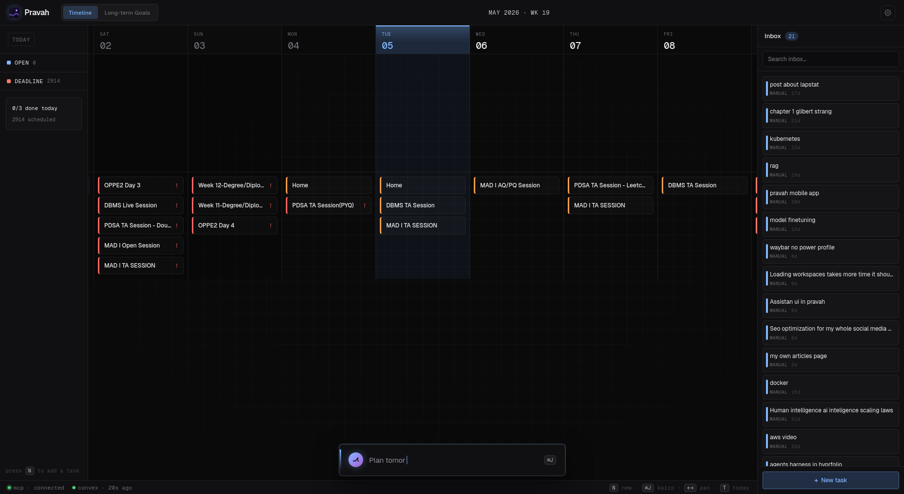

# Pravah

Pravah is a timeline-first task manager built around a horizontal week view. Tasks live either on the timeline (scheduled to a date) or in the inbox (unscheduled). Kairo, an AI copilot docked at the bottom, can reason about your schedule and add tasks on your behalf.



Pravah is currently designed and operated as a single-user system. Auth and `ownerTokenIdentifier` still scope records per signed-in identity, but that isolation exists for session safety, sync ownership, and legacy-data migration compatibility - not as a supported multi-user workspace model.

Stack:
- **Web** — Vite + React (`src/`), Geist fonts, Framer Motion, dnd-kit
- **Backend** — Convex (`convex/`) with Better Auth
- **Mobile** — Expo React Native (`apps/mobile/`)
- **MCP bridge** — `mcp-server.ts` exposes task tools over stdio

## Quick Start

1. Install dependencies

```bash
bun install
```

2. Configure root `.env.local`

```env
CONVEX_DEPLOYMENT=your-deployment
VITE_CONVEX_URL=https://your-deployment.convex.cloud
VITE_CONVEX_SITE_URL=https://your-deployment.convex.site
VITE_GOOGLE_CLIENT_ID=your-google-web-client-id
```

3. Start Convex backend

```bash
bunx convex dev
```

4. Start the web app and confirm the shell loads

```bash
bun run dev
```

Then open the printed local URL and confirm the timeline shell renders before
you move on to mobile or backend debugging.

## Common Commands

| Command | Description |
|---|---|
| `bun run dev` | Start web dev server |
| `bun run build` | Type-check + production build |
| `bun run lint` | ESLint |
| `bun run test:run` | Vitest suite |
| `bun run mcp` | MCP server over stdio |
| `bun run mobile:start` | Start Expo |
| `bun run mobile:android` | Android native build (auto-syncs env) |
| `bun run mobile:ios` | iOS native build |
| `bun run mobile:web` | Expo web |

## Project Structure

```
src/                  React web client
  components/         Timeline, InboxSidebar, Kairo, QuickAdd, TaskPopup, ...
  hooks/              Drag handlers, keyboard shortcuts, overlay state
  lib/                Motion tokens, date utils, Kairo config
convex/               Backend: schema, queries, mutations, HTTP routes
apps/mobile/          Expo React Native app
docs/                 Technical documentation
mcp-server.ts         MCP bridge
```

## Product Scope

- Pravah is a personal planner for one signed-in user, not a shared multi-user workspace.
- Legacy Convex rows without `ownerTokenIdentifier` are claimed by the current user during bootstrap because those rows come from earlier single-user app versions.
- If the product ever expands to true multi-user support, ownership migration and review assumptions should be redesigned explicitly rather than inferred from today's schema.

## Kairo AI Copilot

Kairo sits in the bottom dock (`⌘J` to open). It uses your own API key — configure it in Settings with:
- **Provider format**: OpenAI-compatible or Anthropic
- **API key**: sent directly from your browser, never stored server-side
- **Endpoint URL**: e.g. `https://api.openai.com/v1/chat/completions` or `https://api.anthropic.com/v1/messages`
- **Model**: e.g. `gpt-4o`, `claude-sonnet-4-6`

Click outside the panel or press `⌘J` to close.

## Environment

### Root `.env.local`

```env
CONVEX_DEPLOYMENT=your-deployment
VITE_CONVEX_URL=https://your-deployment.convex.cloud
VITE_CONVEX_SITE_URL=https://your-deployment.convex.site
VITE_GOOGLE_CLIENT_ID=your-google-web-client-id
```

### Convex deployment env

```env
BETTER_AUTH_SECRET=generate-a-random-secret
SITE_URL=http://localhost:5173
GOOGLE_OAUTH_CLIENT_ID=your-google-web-client-id
GOOGLE_OAUTH_CLIENT_SECRET=your-google-web-client-secret
MOBILE_APP_SCHEME=pravah://
CONVEX_HTTP_API_KEY=your-http-api-key
# Optional: additional comma-separated web origins trusted for Better Auth
# session routes and `/google/token` preflights (use for staging/preview deploys).
ALLOWED_CORS_ORIGINS=https://staging.example.com,https://preview.example.com
```

### Mobile env sync

```bash
bun run mobile:env   # generates apps/mobile/.env.local from root env
```

`mobile:start`, `mobile:android`, `mobile:ios`, and `mobile:web` run this automatically.

## CI

GitHub Actions runs on pull requests and pushes to `main`:
- **Lint** — ESLint
- **Build** — Vite production build + TypeScript check
- **Release Please** — automated version bump + release PR/tag flow for web and mobile (on `main`)

### Release flow (web + mobile)

Versioning and GitHub Releases are managed by `release-please`:

- On every push to `main`, it scans Conventional Commits since the last release tag.
- If releasable changes exist, it opens/updates a single release PR that bumps root (`web`) and `apps/mobile` package versions.
- When that release PR merges, it creates component tags and GitHub Releases.

Tag format:

- `web-vX.Y.Z`
- `mobile-vX.Y.Z`

## Documentation

- `docs/architecture.md` — system architecture and module map
- `docs/development.md` — local setup, environment, and workflows
- `docs/api.md` — HTTP routes and MCP tools
- `docs/google-oauth.md` — Google OAuth setup and troubleshooting
- `apps/mobile/docs/README.md` — mobile documentation index
- `apps/mobile/docs/architecture.md` — detailed mobile architecture and state/query ownership
- `apps/mobile/docs/ux-orchestration.md` — mobile loading, keyboard, settings, motion, and Android back behavior
- `apps/mobile/MOBILE_TESTING.md` — ADB-driven QA walk for the mobile app
- `apps/mobile/DEBUGGING.md` — log prefixes, ADB commands, and known dependency pins

## Security Notes

- Never expose `GOOGLE_OAUTH_CLIENT_SECRET` via `VITE_` variables.
- Keep secrets in deployment/server env only.
- Do not commit `.env.local` or real credentials.
